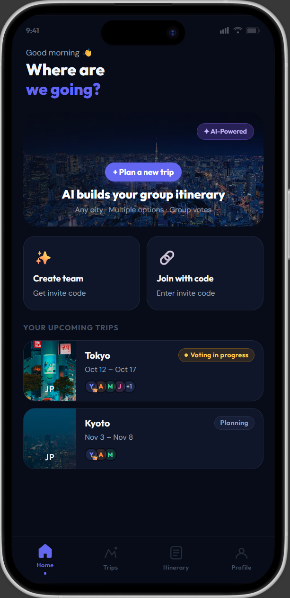
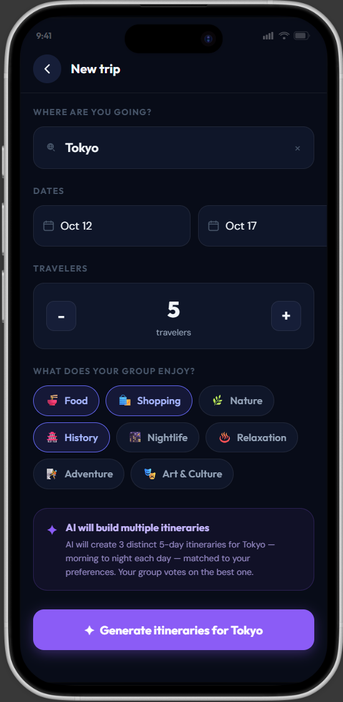
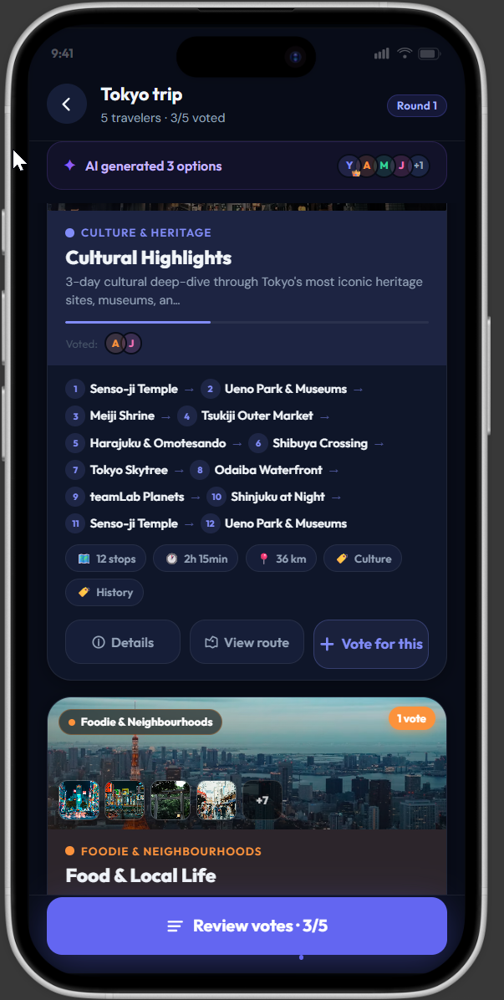
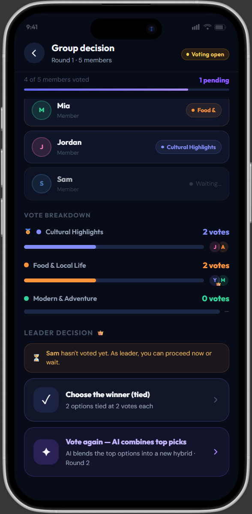
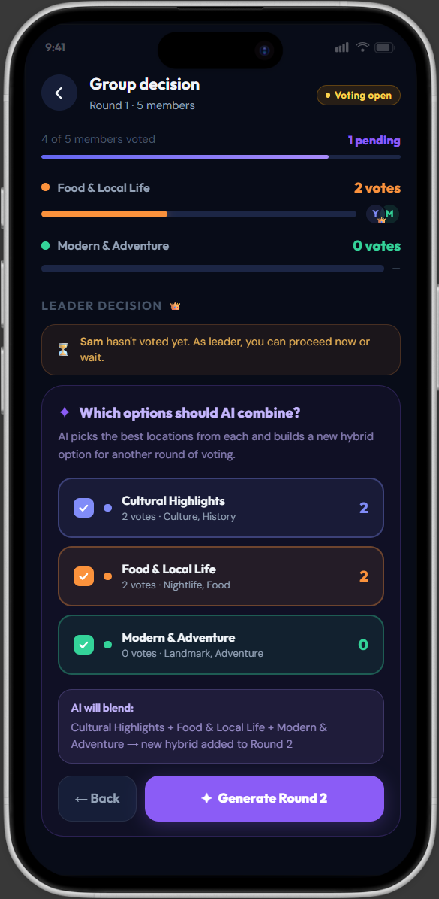
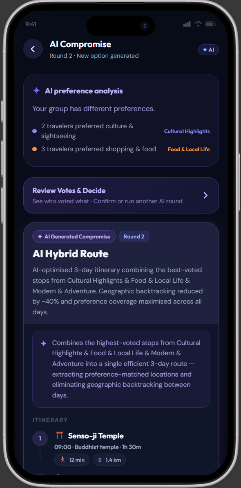
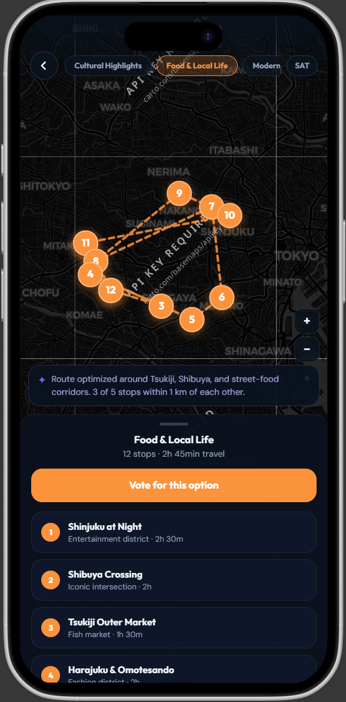

# Codenection-

RADIANT ROUTE by Tiki Taka

Team : Ooi Chong Zee, Chan Zhi YIng, Khor Mei Shi

Problem Statement: Travel Planner

Video Presentation :

Presentation Slides :

1. Project Overview

The Problem: Current tour guides do not have the actual tools to make lots of different itinerary for customers to actually decide on an itinerary that everyone can agree to and be satisfied. Even so, Chat GPT and lots of chatbots don't really have the visuals to persuade users to go to destinations, they use word forms to elaborate what sights or food you'll be seeing or eating while users can't really imagine those visually. The main problem still is current tour guides just average out all possible interests and prints it out on your itinerary, what if you could give them a separate option where they get to choose specific interests. For example, 1st option with more places on food, while second option more places on historical sites, and people might not only have 1 interests, maybe they would all have the same interests.

Our Solution. We presented an app that easily address those issues. Our app has an AI agent that will generate different itineraries based on different interest and based on ideal routes, and if not satisfied they can keep voting until everyone is satisfied as the smart AI will combine top options and be set as another option for people to choose. Not only that, users get to preview the point of view of the places from the itinerary option that they chose to preview to really look into it visually what to be expected. Moreover to address this preference issue, as we talked about generating different options we could have options that focus more on food, another one that focus more on cultural stuff because some cities might have specific stuff that they excek in like historical sites, or even food, or cultural stuff.

2.1 Ideas WE CONSIDERED

Ideas                                                                                                                                                                       || Why it was dropped / kept

To make your phone buzzes and give you like recommended food or places to visit around you when app looks at your itinerary when u have free time                          || Too many unique functions making the app complicated

The planned places will be recommended by datas from the Internet from different sources to be different from traditional tour guides that bring you to crowded places     || Unrealistic, as sources could be unpredictable

3. Prototype walkthrough

    -1. Start a group trip

The landing page introduces Radiant Route and gives the host a clear **Plan New Trip** starting point for creating a collaborative trip.

    -2. Set up the trip group and preferences

After selecting **Plan New Trip**, the host enters the trip’s initial details, such as the destination, number of travellers, dates, and the group’s interests. These inputs give the AI the context it needs to create relevant itinerary options.

    -3. Compare AI-generated routes and vote

The AI produces several route alternatives with different mixes of experiences. Each traveller can review the choices and vote for the route that best matches their preferences, whether that means culture, history, food, or another travel style.

    -4. Let the host choose how to decide

Once voting is complete, the host can either confirm the highest-voted route or ask the AI to combine ideas from the leading options into a more balanced itinerary for the group.

    -5. Select routes to integrate

For a balanced plan, the host selects the route options and preference mixes to integrate. This gives the group control over which experiences should be preserved in the new itinerary.

    -6. Review and vote on the balanced route

Radiant Route presents a newly generated itinerary that combines the selected preferences. Travellers can inspect its route details, leave a review, and vote on the updated plan before the group finalises it.

    -7. Visualise the journey on a map

The map view shows every stop in the itinerary and makes the journey easy to imagine. Travellers can see where they will go, how long each transfer takes, and whether to walk or use another mode of transport between stops.

4. What Makes our idea Different

Core Functionality: The AI agent groups the friends' pooled interests and generates distinct itinerary options, where each option is heavily anchored around a single, specific interest theme (e.g., Option 1 is 80% Food-focused, Option 2 is 80% History-focused).

The Twist: Unlike other apps of giving everyone a watered-down, generic mix of everything, the app creates clear, intentionally biased archetypes. This allows the group to vote on a vibe or dominant theme for the itinerary, forcing a clear decision on what matters most to them. The thing is we could satisfy all the users at the same time, as they might one more out of something instead of another type of places. 

Secondly. traditional travel tools use static images linked to specific venue listings. Here, the visual preview dynamically adapts alongside the mutating AI itinerary, giving users instant visual context for every algorithmic modification, so that they know what they are expecting in each places giving them more convenience instead of just googling the places and checking what to expected there.

5.
